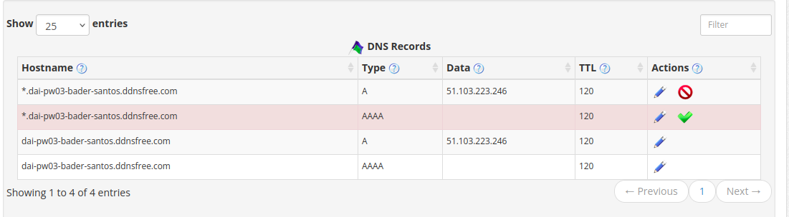
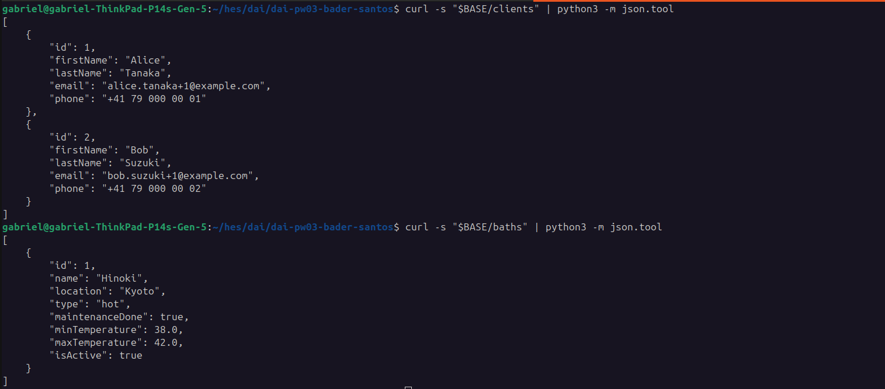

# practical-work-3

`Author` : Gabriel Bader, Mauro Santos

# Introduction

In this document, we will see the installation of the project, including the setup of the Vm and how to work with our project.

# API

You can find the entire description of Our API here [api.md](api.md)

# Web infrastructure

## VM installation

### Initial configuration
To install and configure the VM, we used the great documentation of our units.

You can find it here : https://github.com/heig-vd-dai-course/heig-vd-dai-course/blob/main/11.03-ssh-and-scp/01-course-material/README.md

### Configure DNZ zone

We worked with Dynu to get our free DNS domain. 

1) Go to : https://www.dynu.com/en-US/
2) Create your account and register your new domain. Match your ip with your domain name.
3) Our exemple : dai-pw03-bader-santos.ddnsfree.com 
4) Manage your DSN Record, if not added, check if there is a record type for A and AAAA



## Launch the app

TODO : faire une image docker avant de remplir cette section

After launching, you can acess to :

Treafik : https://traefik.dai-pw03-bader-santos.ddnsfree.com/


## Curl and testing the app

To play with the app, use the following :

### CURL exemple

1) Set the BASE url (easier)
``` bash
BASE="https://dai-pw03-bader-santos.ddnsfree.com"

```

2) If not added, you can add client / bath / record history

Bath 1
```
curl -X POST \
-H "Content-Type: application/json" \
-d '{"name":"Hinoki","location":"Kyoto","type":"hot","maintenanceDone":true,"minTemperature":38.0,"maxTemperature":42.0}' \
"$BASE/baths"
```
Bath 2
```
curl -X POST \
-H "Content-Type: application/json" \
-d '{"name":"Rotenburo","location":"Beppu","type":"outdoor","maintenanceDone":true,"minTemperature":36.0,"maxTemperature":41.0}' \
"$BASE/baths"
```

Bath 3
```
curl -X POST \
-H "Content-Type: application/json" \
-d '{"name":"Mizu","location":"Tokyo","type":"indoor","maintenanceDone":false,"minTemperature":34.0,"maxTemperature":39.0}' \
"$BASE/baths"
```

Client 1
```
curl -X POST \
-H "Content-Type: application/json" \
-d '{"firstName":"Alice","lastName":"Tanaka","email":"alice.tanaka+1@example.com","phone":"+41 79 000 00 01"}' \
"$BASE/clients"
```
Client 2
```
curl -X POST \
-H "Content-Type: application/json" \
-d '{"firstName":"Bob","lastName":"Suzuki","email":"bob.suzuki+1@example.com","phone":"+41 79 000 00 02"}' \
"$BASE/clients"
```

Visits history

```
# Visit 1 (client 1 -> bath 1)
curl -X POST \
  -H "Content-Type: application/json" \
  -d '{"bathId":1,"visitedAt":"2026-01-08T09:00:00Z"}' \
  "$BASE/clients/1/visits"

# Visit 2 (client 1 -> bath 2)
curl -X POST \
  -H "Content-Type: application/json" \
  -d '{"bathId":2,"visitedAt":"2026-01-08T10:30:00Z"}' \
  "$BASE/clients/1/visits"

# Visit 3 (client 2 -> bath 3)
curl -X POST \
  -H "Content-Type: application/json" \
  -d '{"bathId":3,"visitedAt":"2026-01-08T11:15:00Z"}' \
  "$BASE/clients/2/visits"

```

See all 

baths :
```
curl -X GET \
"$BASE/baths"
```
clients :
```
curl -X GET \
"$BASE/clients"
```

Exemple of one of the Results : (note : we used python to format nicely)



Find with last/first name
```
curl -X GET \
"$BASE/clients?firstName=Alice"

curl -X GET \
"$BASE/clients?lastName=Suzuki"

curl -X GET \
"$BASE/clients?firstName=Bob&lastName=Suzuki"
```

Modify a bath :
```
curl -X PUT \
-H "Content-Type: application/json" \
-d '{"id":999,"name":"Hinoki v2","location":"Kyoto Station","type":"indoor","maintenanceDone":false,"minTemperature":36.0,"maxTemperature":41.5,"isActive":true}' \
"$BASE/baths/1"
```
Modify a client
```
curl -X PUT \
-H "Content-Type: application/json" \
-d '{"firstName":"Alice","lastName":"Tanaka-Updated","email":"alice.tanaka+1@example.com","phone":"+41 79 000 00 99"}' \
"$BASE/clients/1"
```

Supprimer un bain :
```
curl -X DELETE \
"$BASE/baths/1"
```

### Url access

##### Bains

Tous les bains :
https://dai-pw03-bader-santos.ddnsfree.com/baths

Un bain par id :
https://dai-pw03-bader-santos.ddnsfree.com/baths/1 (remplace 1)

##### Clients

Tous les clients :
https://dai-pw03-bader-santos.ddnsfree.com/clients

Un client par id :
https://dai-pw03-bader-santos.ddnsfree.com/clients/1 (remplace 1)

Recherche clients :

par prénom : https://dai-pw03-bader-santos.ddnsfree.com/clients?firstName=Alice

par nom : https://dai-pw03-bader-santos.ddnsfree.com/clients?lastName=Tanaka

prénom + nom : https://dai-pw03-bader-santos.ddnsfree.com/clients?firstName=Alice&lastName=Tanaka


##### Visites d’un client :
https://dai-pw03-bader-santos.ddnsfree.com/clients/1/visits